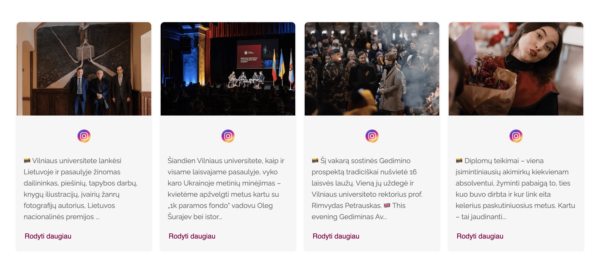

<!-- PROJECT LOGO -->

<br />
<div align="center">
  <a href="https://www.vu.lt/">
    
  </a>

  <h3 align="center">Module - Social Media</h3>

  <p align="center">
The Social Media module is a Joomla extension designed to provide a responsive and customizable social media feed for a website. The module supports both Facebook and Instagram feeds, and allows the user to choose from various layouts, including default, masonry, widget, and carousel.
    <br />
    <br />
		<a href="https://plycneris.com/joomla3example/">Client Demo</a>
    ·
    <a href="https://www.joomla.org/">Joomla</a>
  </p>

[](https://ci.appveyor.com/project/release-joomla/joomla-cms) &nbsp; [](https://www.php.net/) &nbsp; [](https://nodejs.org/en/) &nbsp; [](https://nodejs.org/en/)

</div>

<!-- TABLE OF CONTENTS -->

<details open>
  <summary>Table of Contents</summary>
  <ol>
    <li>
      <a href="#about-the-project">About The Project</a>
      <ul>
				<li><a href="#layouts-demos">Layouts demos</a></li>
        <li><a href="#built-with">Built With</a></li>
      </ul>
    </li>
    <li>
      <a href="#getting-started">Getting Started</a>
      <ul>
				<li><a href="#installation">Installation</a></li>
				<li><a href="#how-to-use">How to use</a></li>
					<ul>
        		<li><a href="#create-a-new-joomla-module">Create a new Joomla module</a></li>
						<li><a href="#set-the-following-parameters">Set the following parameters</a></li>
						<li><a href="#controlling-the-visual-appearance">Controlling the visual appearance</a></li>
						<li><a href="#add-the-css-and-js-assets">Add the CSS and JS assets</a></li>
     		 </ul>
				 	<li><a href="#facebook-api-access">Facebook API Access</a>
					<li><a href="#instagram-api-access">Instagram API Access</a>
					<li><a href="#troubleshooting">Troubleshooting</a>
					<ul>
        		<li><a href="#facebook-api">Facebook API</a></li>
     		 </ul>
				 	<li><a href="#development">Development</a>
				  <ul>
        		<li><a href="#sass-and-js-compilation">Sass and js compilation</a></li>
     		 </ul>
				</li>
      </ul>
    </li>
  </ol>
</details>

<!-- ABOUT THE PROJECT -->
## About The Project

The Social Media module is a Joomla extension designed to provide a responsive and customizable social media feed for a website. The module supports both Facebook and Instagram feeds, and allows the user to choose from various layouts, including default, masonry, widget, and carousel. The module features a range of configuration options that can be used to fine-tune the appearance and behavior of the feed, including the maximum number of items, media type, media layout, and access tokens. The module also includes a caching system for improving the performance of the website, as well as support for external CSS and JavaScript assets.

> I wanted to let you know that my module is currently not compatible with Joomla 4. As you may be aware, Joomla 4 will be adopted in the near future, and I am working on making my module compatible with this new version. I apologize for any inconvenience this may cause and appreciate your patience as I work towards making my module fully functional with Joomla 4. In the meantime, I recommend using my module with Joomla 3 or earlier versions.


## Layouts demos

<details>
  <summary>Default</summary>
 	
</details>

Others will appear soon.. 


<!-- BUILT WITH -->
## Built With

Web technologies used in the development of this extension

    

<!-- INSTALLATION -->
## Installation

1. Download the latest version - [mod_socialmedia-1.0.8.zip](https://plycneris.com/updates/joomla/mod_socialmedia/mod_socialmedia-1.0.8.zip)

2. Install the module in your local Joomla environment.

## How to use

### Create a new Joomla module:

- In your Joomla administrator panel, navigate to "Extensions" > "Modules".
- Click "New" to create a new module.
- Select "Module - Social Media" as the module type.
- Set the module position and other options as desired, and click "Save & Close".
 
### Set the following parameters:

- **Media Type:** Choose either "instagram" or "facebook" from the drop-down list, depending on which type of social media you want to display.
- **Media Layout:** Choose a layout for displaying the social media content. The available options will vary depending on the media type you selected.
- **Page ID:** The ID of the Facebook page to display. Required if the media type is set to "facebook".
- **Max Items:** The maximum number of items to display.
- **Access Token:** The access token for the Instagram or Facebook API. Required for both media types.
- **Store Token:** An optional fallback access token to use if the main access token is unavailable.
- **Client ID:** Required for Facebook API requests. This is the ID of the Facebook app associated with the access token.
- **Client Secret:** Required for Facebook API requests. This is the secret key of the Facebook app associated with the access token.
- **Cache time:** This field specifies the time in seconds for which the module should cache the social media feed data to improve page loading speed.
- **Token backup:** This field is part of a backup mechanism that allows the user to store and restore the access token in case it is lost or becomes invalid.

### Controlling the visual appearance:

- **Show Module Title:** This field allows users to choose whether to display the module title or not. Users can choose between "Yes" and "No" options.
- **Container Width:** This field allows users to set the maximum width of the container that holds the social media feed. The default value is 1230 pixels.
- **Container Margin Top:** This field allows users to set the top margin of the container. The default value is 30 pixels.
- **Container Margin Bottom:** This field allows users to set the bottom margin of the container. The default value is 30 pixels.
- **Show Media Logo:** This field allows users to choose whether to display the social media logo or not. Users can choose between "Yes" and "No" options.
- **Show Card Footer:** This field is only applicable when the "media_type" field is set to "facebook". It allows users to choose whether to display the card footer or not. Users can choose between "Yes" and "No" options.
- **Card Text Color:** This field allows users to set the color of the text in the card. The default value is #666666.
- **Card Links Color:** This field allows users to set the color of the links in the card. The default value is #78003f.
- **Card Button Color:** This field allows users to set the color of the button in the card. The default value is #78003f.
- **Card Background Color:** This field allows users to set the background color of the card. The default value is #f6f6f6.
- **Card Text Size:** This field allows users to set the font size of the text in the card. The default value is 15 pixels.
- **Card Button Size:** This field allows users to set the font size of the button in the card. The default value is 15 pixels.

Users can customize the values of these fields according to their preferences to create a social media feed that suits their website's design and style.

### Add the CSS and JS assets:

- In the module editor, click on the "External" tab.
- Set "External CSS" and "External JS" options.
- In the module parameters, add the URLs of any external CSS and JS files that should be loaded.
- Save and close the module editor.
- Publish the module on your site.

Once the module is set up and published, it should display the social media content from the respective API as specified in the module parameters.

## Facebook API Access

To get a Facebook API access token, client ID, and secret, follow these steps:

1. Go to the Facebook Developer website and log in with your Facebook account.
2. Create a new Facebook app by clicking on the "My Apps" dropdown menu and selecting "Create App".
3. Choose the platform you'll be using the app for, such as "Web" or "iOS", and enter a name for your app.
4. On the dashboard for your new app, click on the "Add Product" button and select the product you want to use, such as "Facebook Login" or "Facebook Pages API".
5. Follow the setup instructions for the product you chose, which may include verifying your domain, adding Facebook Login to your website, or connecting a Facebook page.
6. Once you've completed the setup for your chosen product, you'll be able to access your app's "App ID" and "App Secret" on the app's dashboard under the "Settings" tab.
7. To get an access token for your app, you can use the Facebook Graph API Explorer tool. Log in with the same Facebook account you used to create your app, select your app from the dropdown menu, and generate an access token with the necessary permissions for your app's features.

Note that the process for obtaining an access token may vary depending on your app's requirements and the specific product you're using. Be sure to read the documentation and follow the instructions provided by Facebook to ensure that you're obtaining and using access tokens and other API credentials correctly.

## Instagram API Access

To obtain an Instagram API access token, follow these steps:

1. Log in to your Instagram account, and make sure your account is a business or creator account. If you have a personal account, you will need to convert it to a business account. To do this, go to your profile settings and click "Switch to Professional Account."
2. Go to the Facebook Developer website and create a new app, or use an existing app that is associated with your Instagram account.
3. Once you have created your app, go to the app dashboard, and click on the "Instagram Basic Display" product.
4. Follow the setup instructions to configure your Instagram account for the app. This may include connecting your Instagram account to the app and submitting your app for Instagram review.
5. Once your app is approved by Instagram, you can generate an Instagram API access token from the app dashboard. To do this, go to the "Access Token" tab and click the "Generate Token" button.
6. Copy the access token, and use it in your application to make Instagram API requests.

Note that the process for obtaining an Instagram API access token may vary depending on your app's requirements and the specific Instagram product you're using. Be sure to read the documentation and follow the instructions provided by Facebook and Instagram to ensure that you're obtaining and using access tokens and other API credentials correctly.

## Troubleshooting

### Facebook API

**Facebook API feed posts are being skipped.**

There could be a few different reasons why your Facebook API feed posts are being skipped:

- Permissions: Make sure that your Facebook API access token has the necessary permissions to access the feed of the page you want to display. You may need to generate a new access token with the appropriate permissions.
- Privacy settings: If the posts in the feed have been set to a restricted privacy setting, they may not be accessible through the API. Make sure that the posts you want to display are set to a public privacy setting.
- Time range: By default, the Facebook API will only return posts from the past 30 days. If you're trying to display older posts, you may need to adjust the time range in your API request.
- API changes: Facebook regularly updates their API, so it's possible that changes to the API have affected the way your code interacts with it. Make sure you're using the latest version of the Facebook API and check for any updates to your code or the libraries you're using.

Errors in code: Double-check your code for any errors that might be causing the feed posts to be skipped. Make sure you're properly handling any errors returned by the API and that your code is correctly parsing the data returned by the API.

By addressing these possible issues, you may be able to resolve the problem of skipped feed posts in your Facebook API integration.

**Posts are not rendering.**

- Access token is invalid or expired: Facebook API requires an access token to fetch posts. If the token is invalid or expired, the API will not be able to fetch posts. To fix this, you need to generate a new access token and update it in the module's settings.

- The Facebook app is not approved: If you are using a Facebook app to access the API, it needs to be approved by Facebook. If it is not approved, the API will not be able to fetch posts. To fix this, you need to submit your app for approval to Facebook.
- The page or group is not public: If the page or group from which you want to fetch posts is not public, the API will not be able to fetch posts. You need to make sure that the page or group is public or you have the necessary permissions to access it.
- The user token does not have the required permissions: If you are using a user token to fetch posts, it needs to have the necessary permissions to access the page or group from which you want to fetch posts. If the token does not have the required permissions, the API will not be able to fetch posts. You need to make sure that the token has the necessary permissions.
- The API version is not supported: Facebook frequently updates its API, and older versions may not be supported. If the API version you are using is not supported, the API will not be able to fetch posts. You need to make sure that you are using a supported API version.
- The API rate limit is reached: Facebook API has a rate limit, which limits the number of requests that can be made in a specific time period. If the rate limit is reached, the API will not be able to fetch posts. You need to wait for some time or optimize your requests to avoid hitting the rate limit.
- The module configuration is incorrect: If the module configuration is incorrect, the API will not be able to fetch posts. You need to make sure that the module configuration is correct and all the necessary parameters are set up correctly.

### API Token expired

The module has an automatic refresh token function, which means that it can automatically refresh the access token for the API when it is about to expire.

One important thing to note is that the access token will be refreshed automatically only when Joomla cache is cleaned, and it is necessary to have a valid and working refresh token saved in the module settings. The refresh token is used to obtain a new access token when the old one is about to expire. If the refresh token is not valid or has expired, then the access token will not be refreshed automatically.

### Sass and Js compilation

```
cd modules/mod_socialmedia/build/
npm install 
npm run dev
```
Compiled files
```
cd src/
```
